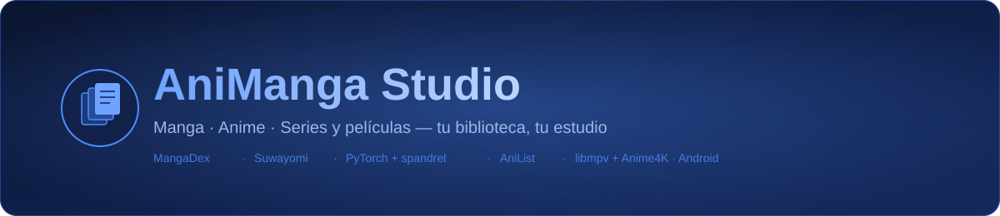
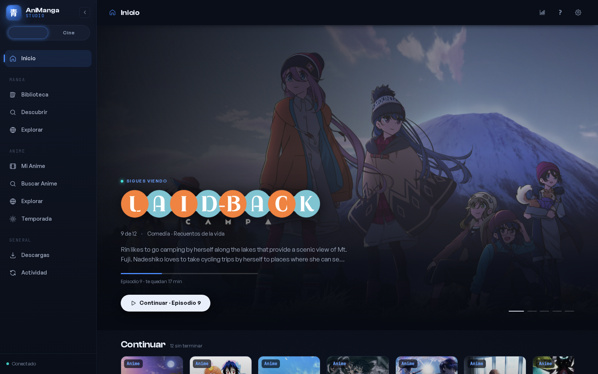
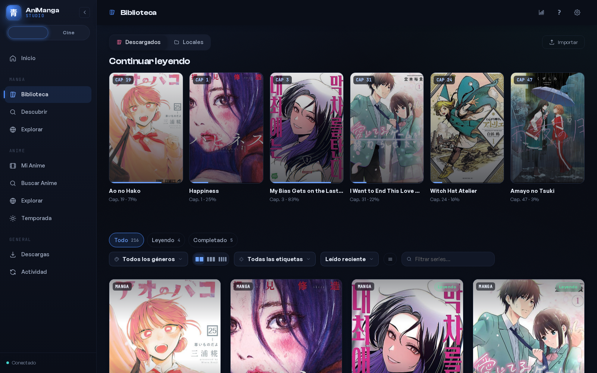
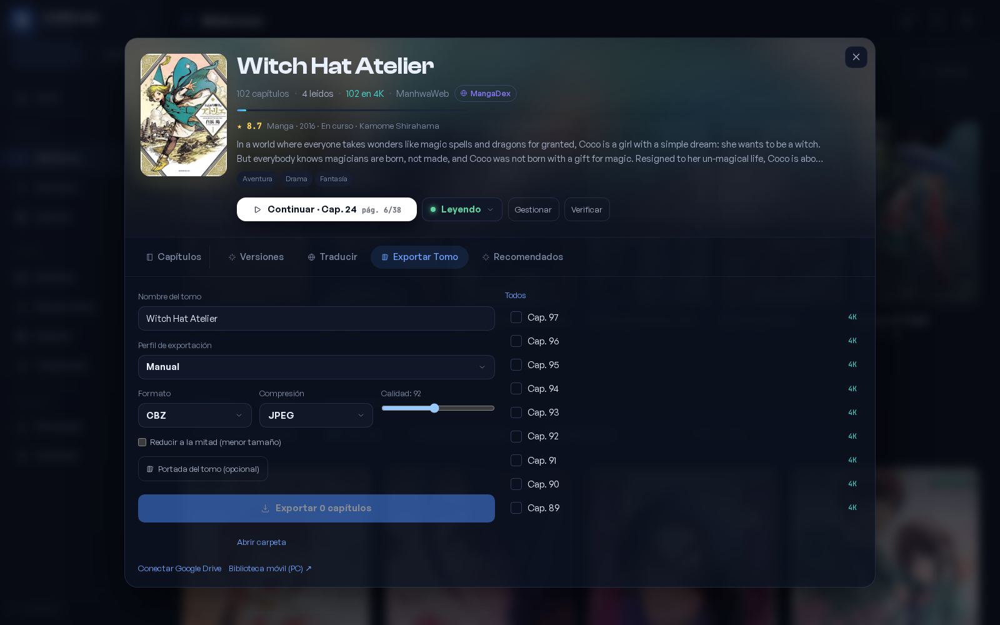
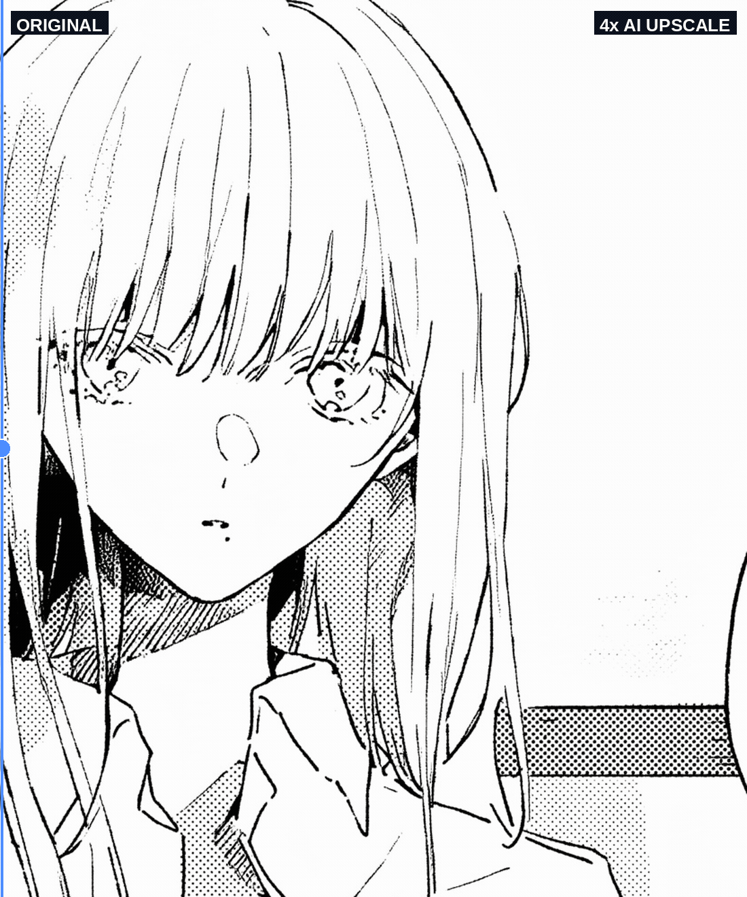
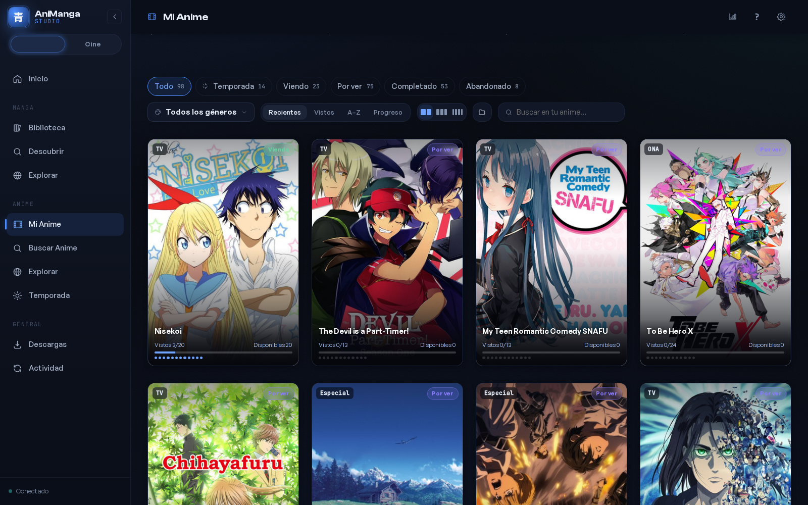
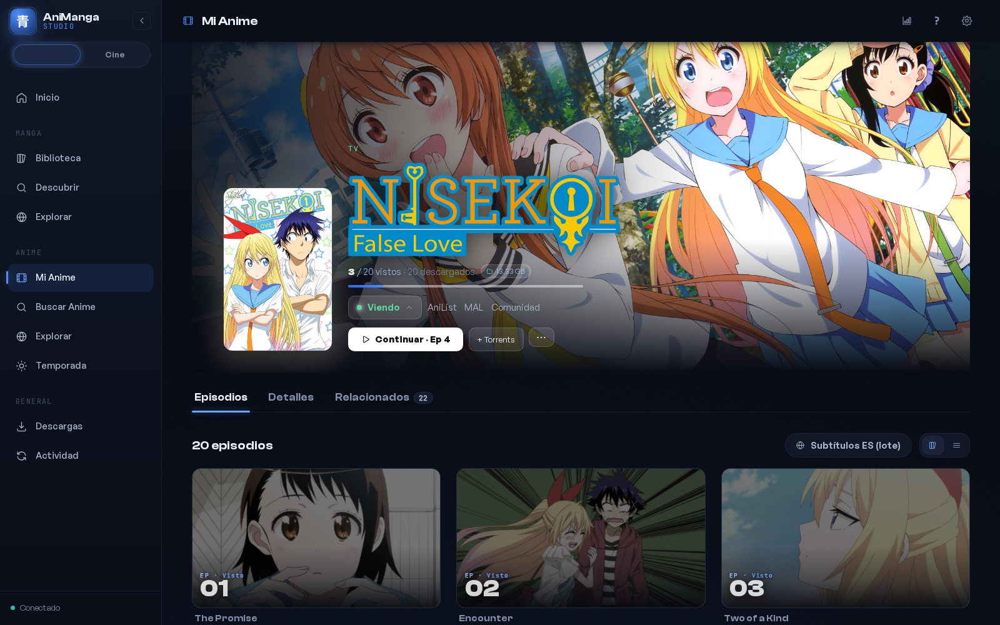
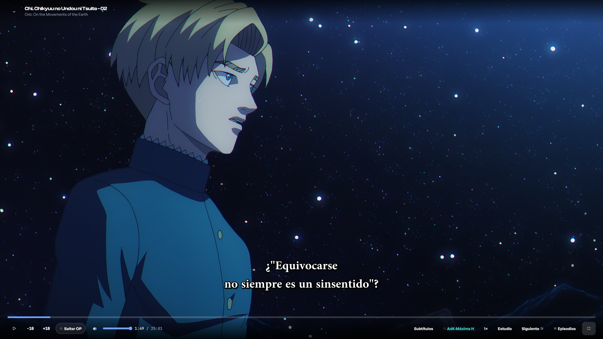
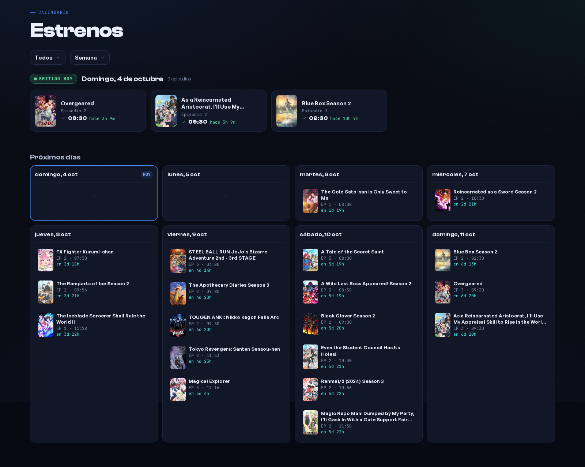
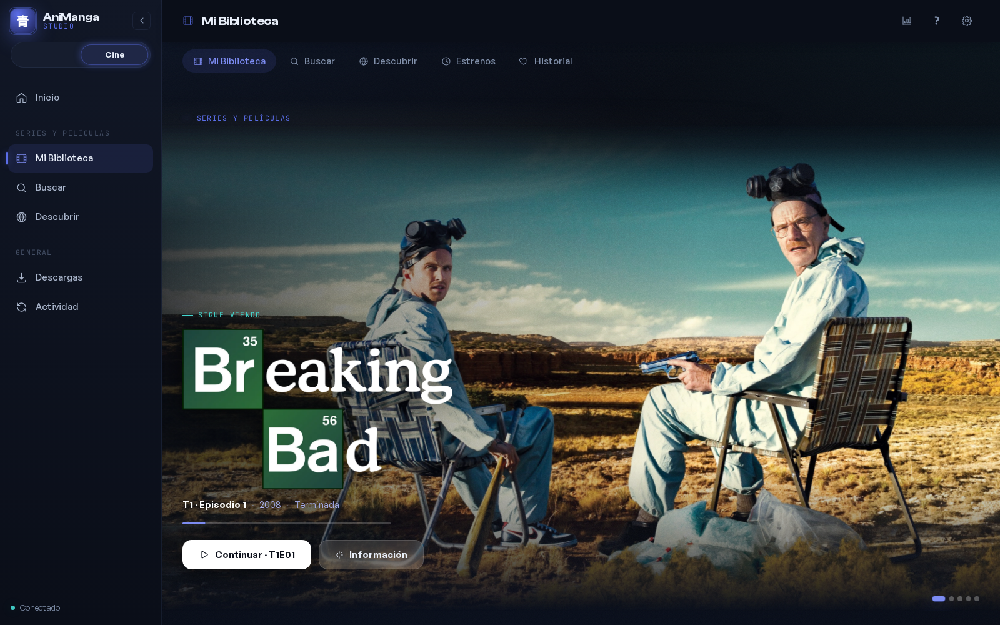

<p align="center">
  
</p>

<p align="center">
  <strong>Tu biblioteca. Tu reproductor. Tu estudio de manga.</strong><br>
  Una aplicación de escritorio para leer, ver, organizar y mejorar tu colección,<br>
  con una app Android complementaria que también puede leer manga sin depender del PC.
</p>

<p align="center">
  <a href="LICENSE">Licencia MIT</a> ·
  <a href="#recorrido-visual">Recorrido visual</a> ·
  <a href="#instalación">Instalación</a> ·
  <a href="#android">Android</a> ·
  <a href="#documentación">Documentación</a>
</p>



## Qué es AniManga Studio

AniManga Studio reúne **manga, anime, series y películas** en una interfaz con
bibliotecas, descubrimiento, progreso y herramientas de procesamiento. El contenido
y el estado se guardan en tu equipo; los catálogos, las fuentes y los servicios de
metadatos necesitan Internet cuando se consultan.

La experiencia principal en Windows utiliza una **ventana propia en Rust/WebView2
y un reproductor libmpv integrado**. El backend Flask y las herramientas de
procesamiento se ejecutan en WSL2. La interfaz compartida está hecha con Vue 3 y
Pinia; no es necesario abrir un navegador para usar la aplicación nativa.

> Es un proyecto en desarrollo activo, no una plataforma de streaming ni un
> paquete con contenido incluido. Las integraciones y las herramientas externas
> se configuran por separado. Consulta [los límites actuales](#límites-actuales).

## Qué puedes hacer

Empieza por el área que quieras utilizar:
[Manga y escalado](docs/MANGA.md) · [Anime y reproductor](docs/ANIME.md) ·
[Series y películas](docs/CINE.md) · [Android](docs/ANDROID.md).
Cada guía explica el recorrido y qué integraciones necesitas.

### Manga: descubrir, leer y preparar tu edición

- **Explorar MangaDex y otras fuentes** mediante Suwayomi, añadir obras y
  descargar capítulos a la biblioteca local.
- **Continuar la lectura** desde la página guardada, con modos paginado y continuo,
  zoom y acceso a originales y páginas escaladas.
- **Leer archivos CBZ/CBR locales** en una biblioteca diferenciada, con progreso
  propio por volumen. La lectura de RAR/CBR requiere `bsdtar`.
- **Escalar con IA** utilizando modelos registrados en `models/registry.json`,
  compatibles con spandrel. Los pesos se añaden por separado y el procesamiento
  necesita una GPU NVIDIA con CUDA. [Guía de modelos](docs/MODELS.md).
- **Comparar versiones y trabajar con traducciones** desde la ficha, con tareas
  de procesamiento y revisión separadas de la lectura cotidiana.
- **Construir tomos CBZ**: seleccionar capítulos, portada, JPEG o WebP y calidad;
  incluir `ComicInfo.xml`, preparar varios trabajos y seguir su progreso tanto
  en la ficha como en Actividad. La cola admite hasta tres exportaciones simultáneas.
- **Guardar los tomos en el equipo** desde la app, sin depender de la bandeja de
  descargas de un navegador; también hay integraciones con Google Drive y WebDAV.

### Anime: biblioteca, estrenos y reproducción

- **Buscar en AniList**, explorar temporadas y recomendaciones, y consultar las
  relaciones y el orden de estreno de una franquicia.
- **Vincular carpetas que ya tienes** o buscar releases en Nyaa y enviarlos a
  qBittorrent. No necesitas volver a descargar un anime para incorporarlo.
- **Ver portadas y títulos de episodios**, con metadatos por temporada cuando
  pueden resolverse y miniaturas locales persistidas cuando hay vídeo disponible.
- **Consultar estrenos por día**, en vista semanal o agenda, y distinguir los
  episodios vistos de los que están descargados.
- **Reproducir con libmpv**: audio y subtítulos seleccionables, progreso,
  siguiente episodio y preferencias de reproducción por anime.
- **Aplicar Anime4K en tiempo real**, con perfiles desde Calidad hasta Máxima
  calidad, incluidas las variantes Referencia y H. Es distinto del escalado
  que genera y guarda un archivo nuevo.
- **Buscar, sincronizar y traducir subtítulos**, usando las fuentes configuradas,
  ffsubsync y Ollama local; inyectarlos en MKV con MKVToolNix cuando corresponda.
- **Consultar la ficha técnica** de un episodio y administrar descargas desde
  una vista común de qBittorrent.

### Cine: series y películas en su propio espacio

- **Cambiar al modo Cine**, con biblioteca, búsqueda, descubrimiento, estrenos e
  historial propios, sin mezclar los títulos con la biblioteca de anime.
- **Integrar Sonarr, Radarr y Prowlarr** para organizar series, películas y búsquedas
  de releases, con qBittorrent como cliente de descarga.
- **Continuar viendo** y utilizar el reproductor compartido, incluyendo pistas
  de audio y subtítulos.

### Herramientas compartidas

Inicio con obras destacadas y accesos para continuar; etiquetas y filtros;
historial; paleta de comandos; actividad con progreso de trabajos; avisos nativos
opcionales; diagnóstico de biblioteca y copias de seguridad del perfil.

## Recorrido visual

Capturas de la interfaz real, no renders ni maquetas. La ficha de Attack on Titan
usa un estado neutral de muestra y no expone progreso personal de la biblioteca.
El reproductor se capturó directamente de la ventana nativa Windows durante la
reproducción. El calendario muestra el catálogo público en la vista real,
sin biblioteca ni historial personales. No incluyen capturas de Android.

### Biblioteca de manga

La lectura pendiente, los estados y los filtros viven junto a tu colección.
Las pestañas distinguen los descargados de los archivos locales.



### Tomo Builder

Selección de capítulos y ajustes de salida dentro de la ficha. Puedes preparar
otro tomo mientras el anterior se procesa; no hace falta esperar a que termine.



### Escalado de manga: antes y después

Una comparación animada del mismo recorte original y su versión escalada 4×.
Permite apreciar los trazos y las tramas; el resultado depende del modelo y
de la calidad de la página de entrada.

<p align="center">
  
</p>

Para preparar tu propio modelo y comparar páginas, consulta la
[guía de manga](docs/MANGA.md) y la [guía de modelos](docs/MODELS.md).

### Mi Anime

Obras destacadas, continuar viendo y biblioteca con filtros de estado y género.



### Ficha y episodios

El estado de visionado y los archivos disponibles son conceptos separados.
Cada episodio reúne su imagen, progreso y acciones de reproducción o descarga.



### Reproductor nativo de PC

Vídeo real en la ventana Windows con libmpv, capturado durante la reproducción
sin pausarla. Los controles reúnen posición, saltos, volumen, subtítulos,
Anime4K y acceso a episodios. En esta captura está seleccionado el perfil H.



### Calendario de estrenos

Consulta qué sale cada día y cambia entre la semana y una agenda compacta.
Los horarios dependen de la información recibida del catálogo.



### Series y películas

El modo Cine cambia la navegación y mantiene una biblioteca propia.



## Android

**Android es otro proyecto**, desarrollado en Kotlin y Jetpack Compose, en la
carpeta hermana `animanga-android`. Su código y su APK no forman parte de este
repositorio; no es una versión de la web empaquetada.

- MangaDex y extensiones compatibles con Mihon, con biblioteca y descargas locales.
- Lectura sin conexión y sin necesitar que el PC esté encendido para los mangas
  añadidos desde las fuentes del móvil.
- **Mi PC** como origen adicional: importar capítulos concretos, incluidas las
  páginas escaladas, sin copiar toda la biblioteca de escritorio.
- Biblioteca **Archivos** para CBZ/CBR, separada de MangaDex y del PC.
- Anime del PC mediante libmpv, descarga para verlo sin conexión, progreso y
  calendario de temporada.

El escalado de manga con IA y las tareas pesadas de traducción permanecen en el
PC. El móvil consume sus resultados. Consulta [la separación PC/Android y el
acceso remoto](docs/ANDROID.md); el antiguo plan de migración es documentación
histórica, no una lista fiable del estado actual.

## Requisitos por función

| Función | Qué necesita |
|---|---|
| Backend e interfaz | Python **3.11 o posterior** por las dependencias actuales; Node **20.19+ o 22.12+** y pnpm para compilar |
| Escritorio Windows principal | Windows, WebView2, shell Rust con libmpv y backend en WSL2 |
| Escalado de manga con IA | GPU NVIDIA, driver compatible, PyTorch con CUDA y pesos de modelos |
| Anime4K en vivo | GPU compatible con el renderizador de libmpv y shaders instalados; no utiliza el worker PyTorch |
| Torrents | qBittorrent con WebUI/API habilitada y accesible desde el backend |
| Fuentes de manga | Java y Suwayomi con sus extensiones configuradas |
| Cine | Sonarr, Radarr y Prowlarr configurados según las funciones utilizadas |
| Subtítulos y herramientas de vídeo | ffmpeg/ffprobe, ffsubsync, MKVToolNix y Ollama según la operación |
| Lectura CBR/RAR | `bsdtar` |

**CUDA no es un requisito universal para leer, organizar o ver tu biblioteca.**
Una integración ausente limita su función; no implica que debas instalar toda
la pila para empezar.

## Instalación

### Escritorio Windows: experiencia principal

La ruta principal combina el **shell nativo de Windows** y el motor en **WSL2**.
El repositorio contiene el constructor de `AniMangaStudio-Setup.exe`, pero no se
promete aquí una descarga pública ni una instalación en un equipo nuevo ya validada.

Para preparar el motor, compilar el shell y entender las alternativas, consulta
[Instalación de escritorio](docs/INSTALL_DESKTOP.md).

### Backend e interfaz para desarrollo en Linux/WSL

```bash
git clone https://github.com/RoierOc/animanga-studio.git
cd animanga-studio
python3 -m venv .venv
source .venv/bin/activate
python -m pip install -r requirements.txt
pnpm --dir frontend install --frozen-lockfile
pnpm --dir frontend build
bash scripts/init-env.sh
./start_server.sh
```

Abre `http://127.0.0.1:5101`. Este acceso sirve para desarrollo y para la
interfaz compartida; **no sustituye el reproductor nativo principal**.
El repositorio necesita autorización para clonarse mientras sea privado.
Para GPU, dependencias del sistema e integraciones, sigue [la guía completa](docs/INSTALL.md).

### Configuración

Los directorios de datos y los modelos se configuran aparte del código.
Usa `.env.example` y **Ajustes → Conexiones y claves API** como puntos de partida.

| Integración | Configuración principal |
|---|---|
| MangaDex | Credenciales opcionales para las funciones de cuenta; el catálogo público no exige iniciar sesión |
| TMDB | Clave para metadatos e imágenes cuando la correspondencia puede resolverse |
| qBittorrent | WebUI, dirección y credenciales configuradas en Ajustes |
| Subtítulos | Credenciales de las fuentes que quieras usar y modelo local de Ollama |
| Suwayomi | Servicio Java y extensiones instaladas |
| Cine | Conexiones y claves de Sonarr, Radarr y Prowlarr |
| Modelos IA | Pesos locales y entradas en `models/registry.json` |

No publiques `.env`, tokens, configuración personal ni bibliotecas. Para acceso
desde Android, usa el emparejamiento y la autenticación de la app; fuera de la
red local, una VPN privada. **No abras el backend directamente a Internet.**

## Límites actuales

- Las fuentes, los catálogos y los metadatos son servicios externos: pueden
  cambiar, limitar solicitudes o no tener una correspondencia para tu edición.
- Las dependencias y los pesos de IA no se incluyen en Git. Los scripts de descarga
  no garantizan conseguir todos los modelos sin configurar sus URLs.
- La opción de exportación denominada **CBR** actualmente escribe un contenedor
  ZIP con esa extensión, no un RAR auténtico. **Usa CBZ para interoperabilidad.**
  Esto no afecta a la lectura de CBR/RAR reales mediante `bsdtar`.
- Los scripts Linux/Tauri y Windows sin WSL son rutas alternativas; no tienen
  por ello la misma validación ni las mismas capacidades que el shell principal.
- Las pruebas automatizadas no acreditan por sí solas una instalación nueva,
  el rendimiento de una GPU ni la reproducción en cada dispositivo.

## Desarrollo

```bash
pnpm --dir frontend test
pnpm --dir frontend build
python -m pytest tests/ -q
```

Las pruebas Python necesitan pytest y las dependencias de los módulos que
importan. El workflow [CI](.github/workflows/ci.yml) describe su entorno.

```text
animanga-studio/
├── frontend/            # Vue 3 + Pinia + Vite; interfaz actual
├── src/api/             # API Flask y servicios por dominio
├── desktop/native/      # Shell Windows: Rust, WebView2 y libmpv
├── desktop/windows/     # Constructor y aprovisionamiento del instalador
├── desktop/wsl/         # Preparación del motor WSL
├── models/              # Registro versionado; pesos fuera de Git
├── scripts/             # Configuración y descarga de recursos
├── tests/               # Regresiones del backend
├── suwayomi/            # Integración de fuentes de manga
├── servarr/             # Integración de series y películas
├── docs/                # Guías de uso, instalación e integraciones
└── data/                # Datos locales generados; fuera de Git
```

`static/` y `templates/` contienen la interfaz histórica. No son el frontend
principal ni el punto de partida para nuevas funciones.

## Documentación

- [Instalación y configuración del motor](docs/INSTALL.md).
- [Aplicación de escritorio y rutas de instalación](docs/INSTALL_DESKTOP.md).
- [Modelos de escalado](docs/MODELS.md).
- [Series y películas: Servarr](docs/SERVARR.md).
- [Android, independencia y acceso al PC](docs/ANDROID.md).

## Licencia y contenido

El código de este repositorio se distribuye bajo [MIT](LICENSE).
Las dependencias, los modelos y sus pesos conservan sus propias licencias.
Las portadas, los logotipos y las obras visibles en las capturas pertenecen a
sus respectivos titulares y **no quedan cubiertos por la licencia MIT del código**.
Utiliza las fuentes y los archivos conforme a sus condiciones y a tus derechos
de acceso. El proyecto no incluye manga, episodios, películas ni credenciales.
