<p align="center">
  
</p>

<p align="center">
  
  
  
  
  
</p>

<p align="center">
  Self-hosted manga manager, AI upscaler and anime studio. Search, download and
  read manga from MangaDex or hundreds of other sources (via Suwayomi), upscale
  pages with any GPU model you plug in, export to CBZ, and watch tracked anime
  with auto-downloaded torrents and synced/translated subtitles — all local,
  all yours.
</p>

<br>

<p align="center">
  <a href="#-features">✨ Features</a> ·
  <a href="#-tour">📸 Tour</a> ·
  <a href="#-quick-start">🚀 Quick start</a> ·
  <a href="#-instalación-en-arch-linux">🐧 Arch Linux</a> ·
  <a href="#-configuración">🔧 Configuración</a> ·
  <a href="#-estructura-del-proyecto">📁 Estructura</a> ·
  <a href="#-licencia">📄 Licencia</a>
</p>

---

## ✨ Features

### 📚 Manga

- **MangaDex + Suwayomi**: descargá capítulos directo de MangaDex (login OAuth
  opcional, solo necesario para seguir títulos o acceder a grupos de
  scanlation privados) o de cualquier fuente que tenga extensión
  [Mihon/Tachiyomi](https://github.com/Suwayomi/Suwayomi-Server) — miles de
  sitios cubiertos sin que el proyecto tenga que integrarlos uno por uno.
- **Escalado AI, "pon tu modelo"**: el escalador no trae un modelo fijo
  cableado en el código. Cualquier peso compatible con
  [spandrel](https://github.com/chaiNNer-org/spandrel) (`.pth`/`.safetensors`)
  va a `models/`, se registra en `models/registry.json`, y aparece en el
  selector de la UI — cualquier arquitectura (ESRGAN, RRDBNet, SwinIR, HAT,
  DAT...), cualquier escala (2x, 4x...), sin tocar una línea de código. Sirve
  para mejorar la calidad de scans viejos/de baja resolución antes de leerlos
  o exportarlos. Ver [docs/MODELS.md](docs/MODELS.md).
- **Export CBZ/CBR + Tomo Builder**: un "tomo" es un volumen — varios
  capítulos combinados en un solo archivo `.cbz`/`.cbr`. El Tomo Builder te
  deja elegir qué capítulos van en cada tomo (originales o ya escalados) y
  genera el archivo, listo para abrir en cualquier lector de cómics (o
  llevarlo a tu e-reader/tablet en vez de tener cientos de carpetas sueltas).

### 🎬 Anime Studio

- **Tracking con AniList**: tu biblioteca de anime, progreso de episodios,
  recomendaciones y el chart de temporada — todo sincronizado con tu cuenta
  de [AniList](https://anilist.co).
- **Nyaa + qBittorrent**: [Nyaa](https://nyaa.si) es un indexador de torrents
  de anime; la app busca ahí, y al elegir un release lo manda directo al
  WebAPI de qBittorrent (que tenés que tener corriendo, con su WebUI en
  `:8080`) — sin pasos manuales entre "encontrar el episodio" y "que se
  descargue".
- **MPV + skip-intro**: los episodios descargados se reproducen en
  [MPV](https://mpv.io). Un script (`mpv/skip-intro.lua`) agrega un botón
  flotante "Saltar OP" que salta automáticamente la introducción.
- **Subtítulos, de punta a punta**:
  - *Buscar*: en [Jimaku](https://jimaku.cc), OpenSubtitles o SubDL (las que
    configures en `.env`).
  - *Sincronizar*: con `ffsubsync`, que ajusta automáticamente el timing del
    subtítulo al audio del episodio (útil cuando el sub que conseguiste no
    calza con tu release).
  - *Traducir*: con **Ollama** (un modelo de lenguaje corriendo 100% local en
    tu propia GPU/CPU, gratis y privado, pero necesita tener el modelo
    descargado y algo de VRAM/RAM libre) o con **Gemini** (API de Google en
    la nube — no usa tus recursos pero necesita internet y una API key
    gratuita). Ollama es el motor por defecto (con fallback automático a
    Gemini si Ollama no responde); cambialo con `TRANSLATION_ENGINE=gemini`
    en `.env` si preferís lo opuesto.
  - *Inyectar*: el subtítulo final se mete dentro del `.mkv` con `mkvmerge`
    (no `ffmpeg` — omite el índice de cues y MPV no llega a leer todos los
    paquetes), así te queda un solo archivo con todo embebido.

### 📱 Mobile

- **Export vía WebDAV**: la app expone tu biblioteca (o los tomos
  exportados) por WebDAV, un protocolo de archivos por red que la mayoría de
  lectores de cómics/manga en Android e iOS soportan nativamente (por
  ejemplo Moon+ Reader o Perfect Viewer) — agregás la URL una vez en el
  lector de tu teléfono y listo, sin copiar archivos a mano cada vez.

---

## 📸 Tour

Un recorrido por cada vista de la app. Primero el lado manga, después Anime Studio.

### Biblioteca (Library)

Tu colección local de manga — portadas, estado leído/no leído, y filtros
rápidos por estado. Es la vista principal.

<p align="center">
  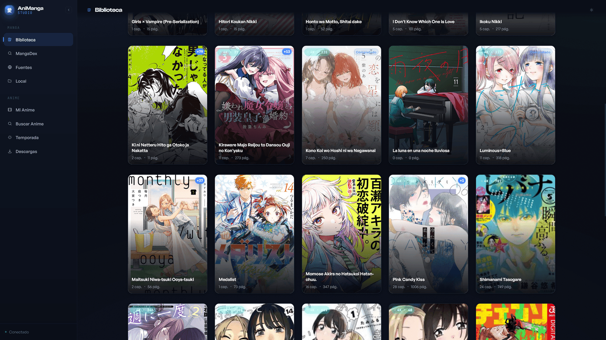
</p>

### MangaDex

Buscá directo en MangaDex (login OAuth opcional, solo necesario para seguir
títulos o acceder a algunos grupos de scanlation), previsualizá capítulos, y
descargalos directo a tu biblioteca local.

<p align="center">
  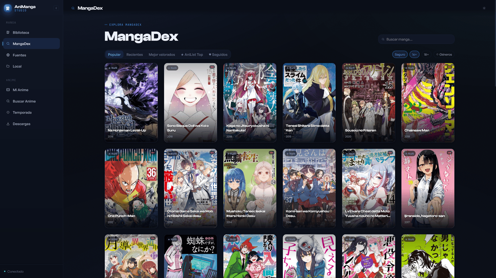
</p>

### Fuentes (Sources)

Búsqueda multi-fuente con [Suwayomi](https://github.com/Suwayomi/Suwayomi-Server) —
cualquier extensión compatible con Mihon/Tachiyomi funciona acá, para títulos
que MangaDex no tiene. Las descargas van a la misma biblioteca local que todo
lo demás.

<p align="center">
  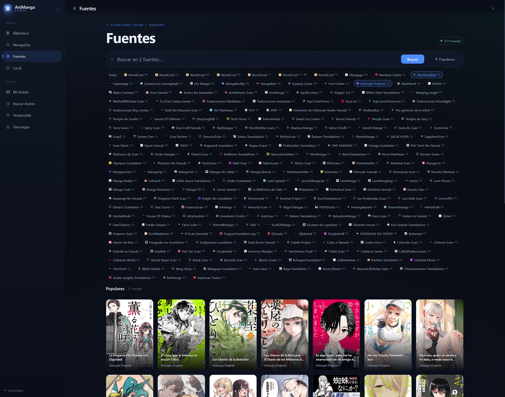
</p>

### Detalle de manga y escalado

Al abrir un manga ves sus capítulos, estado de lectura, y acciones por
capítulo: leer, comparar variantes de scanlation, exportar, borrar, o
**escalar a 4K**. El badge muestra qué capítulos ya están escalados. El
escalado corre en tu propia GPU con el modelo que registres — "pon tu
modelo", ver [docs/MODELS.md](docs/MODELS.md).

<p align="center">
  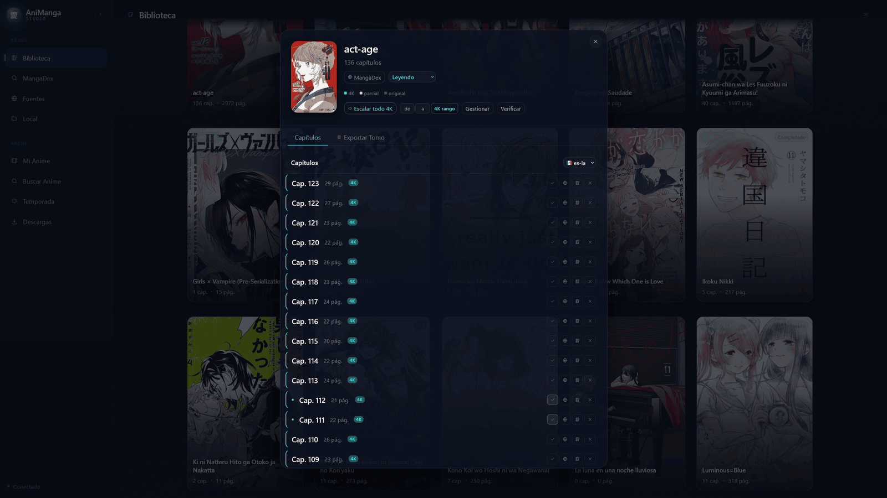
</p>

<p align="center">
  <br>
  <sub>Mismo recorte de página: resolución original vs. el resultado de escalar 4x con IA.</sub>
</p>

### Lector (Reader)

Lector integrado para capítulos descargados, originales o escalados.
Navegación por teclado y click, contador de páginas, y toggle original/4K
por capítulo.

<p align="center">
  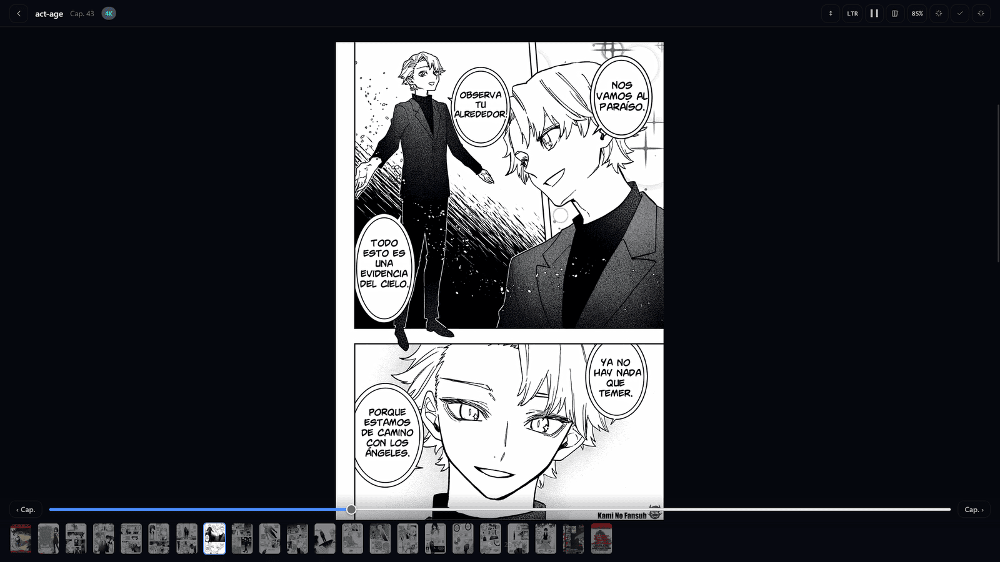
</p>

### Mi Anime (Anime library)

Tu anime trackeado: un hero banner con el último episodio emitido, "seguir
viendo" con progreso, y la biblioteca completa con filtros y orden por
estado.

<p align="center">
  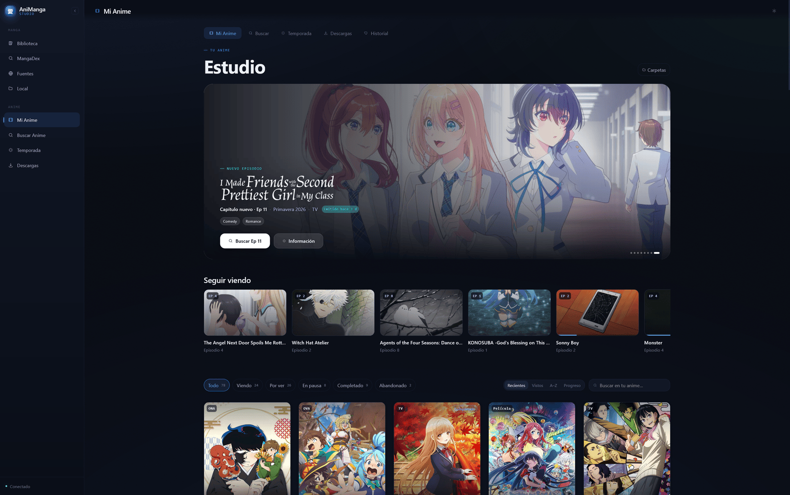
</p>

### Detalle de anime y recomendaciones

Lista de episodios, tags, "listas de interés" derivadas de MAL, y
recomendaciones de AniList con portada — click directo para agregar shows
relacionados a tu biblioteca.

<p align="center">
  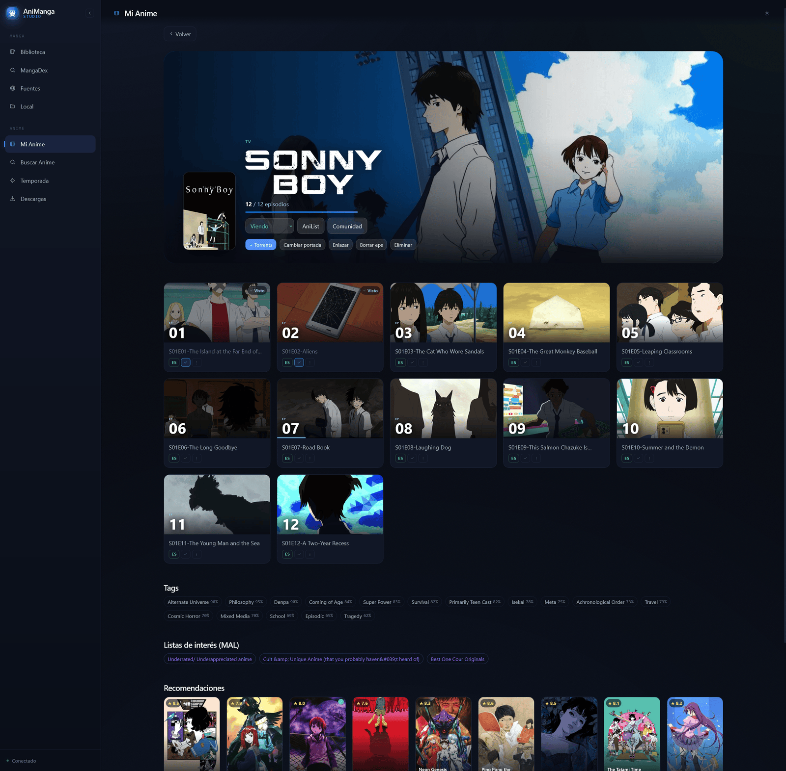
</p>

### Buscar Anime (Search)

Buscá cualquier show en AniList y agregalo a tu biblioteca, o saltá directo
a buscar un torrent del episodio.

<p align="center">
  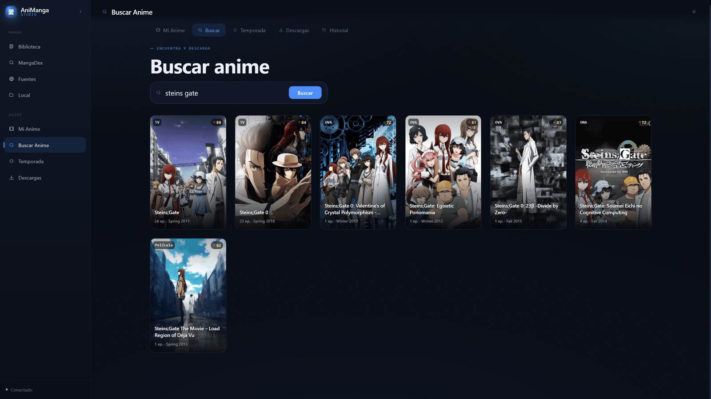
</p>

### Temporada (Seasonal)

Chart de la temporada actual desde AniList, con filtros de género, formato y
orden — descubrí qué se está emitiendo sin salir de la app.

<p align="center">
  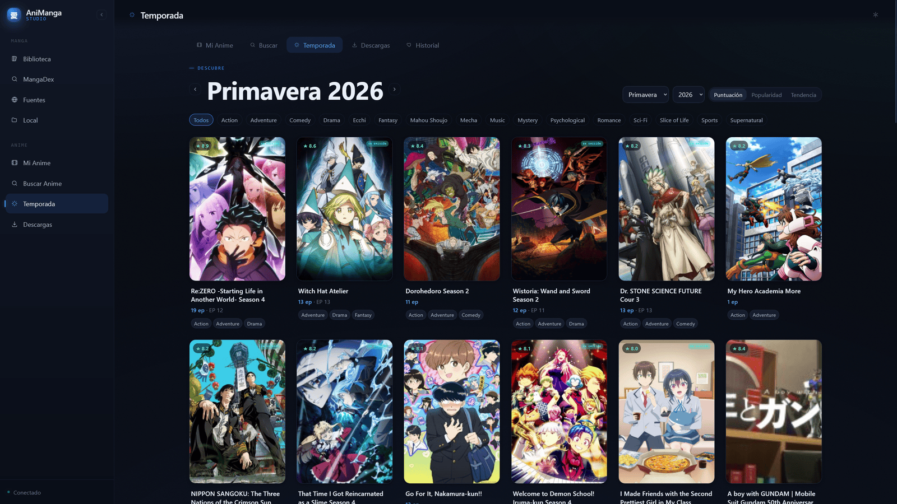
</p>

### Descargas (Downloads)

Búsqueda en Nyaa conectada al WebAPI de qBittorrent: elegí un release,
mandalo a qBittorrent, y aterriza en tu carpeta de descargas configurada,
listo para ver en MPV con skip-intro y subtítulos sincronizados.

<p align="center">
  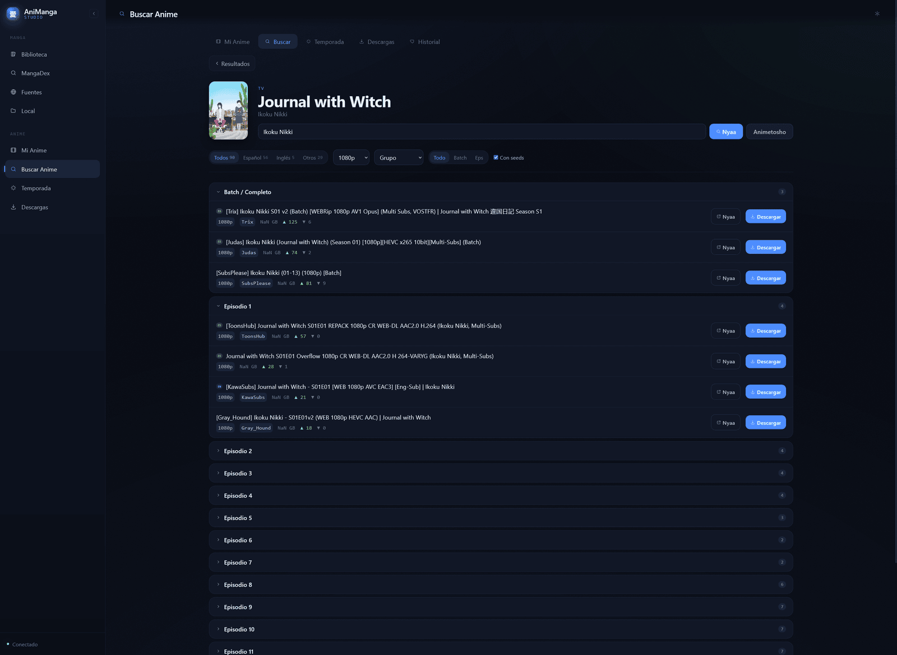
</p>

<p align="center">
  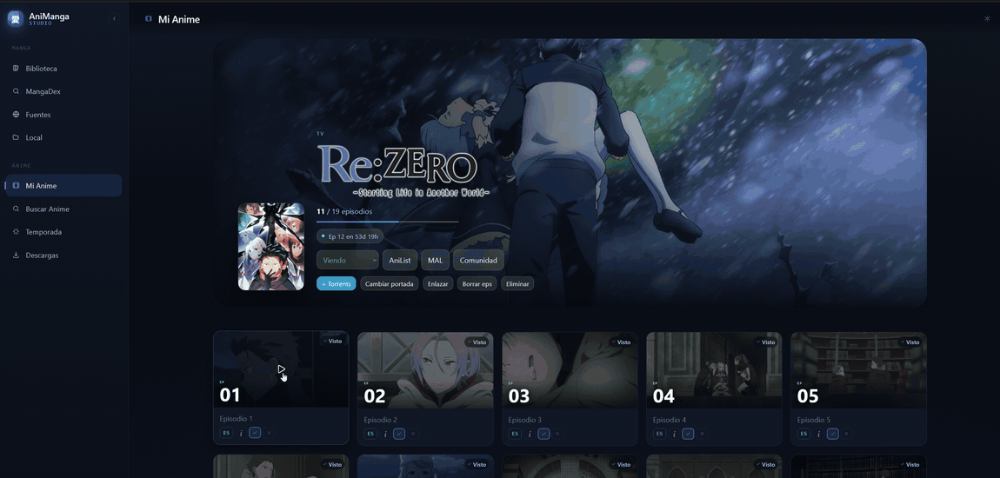<br>
  <sub>Un click sobre un episodio lo lanza directo en MPV, con skip-intro y subtítulos ya sincronizados esperando.</sub>
</p>

---

## 🖥️ App de escritorio (recomendado)

La forma principal de usar AniManga Studio: una app instalable que arranca el
backend al abrirla y lo apaga al cerrar la ventana — sin encender servers a mano.
Reproductor de anime embebido estilo Crunchyroll (streaming sin pérdida, subtítulos
ASS fieles, Anime4K por WebGPU) y Suwayomi bajo demanda.

**Linux (Arch/Manjaro/EndeavourOS):**

```bash
git clone <this-repo> animanga && cd animanga
bash desktop/install.sh
```

Después busca **AniManga Studio** en tu lanzador de aplicaciones. Para actualizar:
`git pull` y re-ejecuta el instalador (es idempotente).

**Windows (un clic — recomendado):**

En un equipo Windows nuevo, todo se instala con **`AniMangaStudio-Setup.exe`**: no
hay que preparar WSL a mano. El instalador habilita **WSL2**, instala la distro
**archlinux**, clona el repo, prepara dependencias, venv, frontend, **PyTorch CUDA**,
**Suwayomi**, **modelos** y **`.env`**, y crea el acceso directo. Si Windows pide
reiniciar para activar WSL2, al volver a iniciar sesión la preparación **continúa
sola**. Es idempotente: re-ejecútalo para actualizar.

> Requisito: **GPU NVIDIA con su driver de Windows** (WSL usa el driver del host).
> El instalador avisa si CUDA no está disponible, pero no puede instalar el driver.

_Alternativa manual_ (si ya tienes tu distro WSL montada): dentro de WSL, en la
carpeta del proyecto, `bash desktop/install.sh` — detecta WSL, prepara todo y crea
el acceso directo. Los scripts `scripts/fetch-*.sh` e `init-env.sh` son idempotentes
y reutilizables para migraciones.

**Windows (nativo, sin WSL — experimental):**

```powershell
winget install Python.Python.3.12 OpenJS.NodeJS pnpm.pnpm Rustlang.Rustup Git.Git
rustup default stable-msvc
git clone <this-repo> animanga; cd animanga
powershell -ExecutionPolicy Bypass -File desktop\install.ps1
```

Detalles, dependencias opcionales y cómo funciona el ciclo de vida:
**[docs/INSTALL_DESKTOP.md](docs/INSTALL_DESKTOP.md)**.

---

## 🚀 Quick start (modo server, sin app)

```bash
git clone <this-repo>
cd manga-upscaler
python3 -m venv .venv && source .venv/bin/activate
pip install torch torchvision --index-url https://download.pytorch.org/whl/cu130
pip install -r requirements.txt
playwright install chromium
cp .env.example .env   # fill in what you need — everything is optional
./start_server.sh
```

Open **http://localhost:5101**.

Esta es la versión corta — ver **[docs/INSTALL.md](docs/INSTALL.md)** para la
guía completa paso a paso (paquetes por sistema, Suwayomi, build del
frontend, secretos, Windows sin WSL), o la sección de [Arch Linux](#-instalación-en-arch-linux)
si es tu distro.

---

## 🐧 Instalación en Arch Linux

Guía paso a paso pensada para Arch (o derivadas como Manjaro/EndeavourOS).
Todos los nombres de paquete están verificados contra los repos oficiales.

**1. Herramientas base**

```bash
sudo pacman -S --needed base-devel git python python-pip nodejs npm pnpm
```

**2. GPU NVIDIA + CUDA** (requisito duro — no hay fallback a CPU)

```bash
sudo pacman -S --needed nvidia-open nvidia-utils cuda
```

`nvidia-open` cubre GPUs Turing (RTX 20xx) en adelante. Si tenés una tarjeta
más vieja, mirá la [wiki de Arch sobre NVIDIA](https://wiki.archlinux.org/title/NVIDIA)
para el paquete correcto. **Reiniciá** después de instalar el driver y
verificá con:

```bash
nvidia-smi
python -c "import torch; print(torch.cuda.is_available(), torch.cuda.get_device_name(0))"
```

**3. Suwayomi** (opcional — multi-fuente, ver [Fuentes](#fuentes-sources) en el Tour)

```bash
sudo pacman -S --needed jdk21-openjdk xorg-server-xvfb
mkdir -p suwayomi
wget -O suwayomi/Suwayomi-Server.jar \
  "$(curl -s https://api.github.com/repos/Suwayomi/Suwayomi-Server/releases/latest \
     | grep -oP '"browser_download_url":\s*"\K[^"]+\.jar')"
```

`xorg-server-xvfb` solo hace falta si corrés esto en una máquina **sin**
entorno gráfico (servidor headless) — Suwayomi usa un WebView embebido que
necesita algún X disponible. Si tenés Arch con escritorio (X11/Wayland) ya
corriendo, podés omitirlo. `suwayomi/start.sh` lo arranca en
`127.0.0.1:4567` — una vez arriba, instalá ahí las extensiones (fuentes) que
quieras desde su WebUI.

**4. Anime Studio:** ffmpeg, mkvmerge, mpv, qBittorrent

```bash
sudo pacman -S --needed ffmpeg mkvtoolnix-cli mpv qbittorrent-nox
```

`qbittorrent-nox` es la versión sin interfaz (recomendada, solo usás su
WebUI en `:8080`). Si preferís la versión con ventana: `qbittorrent` en vez
de `qbittorrent-nox`.

**5. Ollama** (opcional — traducción de subtítulos local, alternativa a Gemini)

```bash
sudo pacman -S --needed ollama
ollama pull qwen2.5:14b
```

**6. Clonar, instalar dependencias Python y arrancar**

```bash
git clone <este-repo>
cd manga-upscaler
python -m venv .venv && source .venv/bin/activate
pip install torch torchvision --index-url https://download.pytorch.org/whl/cu130
pip install -r requirements.txt
playwright install chromium
cd frontend && pnpm install && pnpm build && cd ..
cp .env.example .env   # completá lo que vayas a usar — ver tabla más abajo
./start_server.sh
```

Abrí **http://localhost:5101**. Los modelos de escalado no vienen incluidos
(son binarios pesados) — ver [docs/MODELS.md](docs/MODELS.md) para
descargarlos o agregar uno propio.

<details>
<summary><strong>Otros sistemas (Windows/WSL2, macOS, otras distros Linux)</strong></summary>
<br>

La guía completa con comandos `apt`/Homebrew y particularidades de cada
sistema (Suwayomi headless, auto-arranque en Windows, etc.) está en
**[docs/INSTALL.md](docs/INSTALL.md)**.

</details>

---

## 🔧 Configuración

Todo vive en `.env` (copiado de `.env.example`):

| Variable(s) | De dónde sacarlas |
|---|---|
| `SECRET_KEY` | `python -c "import secrets; print(secrets.token_hex(32))"` |
| `MANGADEX_CLIENT_ID/SECRET/USERNAME/PASSWORD` | [mangadex.org](https://mangadex.org) → Settings → API Clients |
| `TMDB_API_KEY` | [themoviedb.org](https://www.themoviedb.org/settings/api) (gratis) — opcional, mejora los banners de anime |
| `GEMINI_API_KEY` | [aistudio.google.com/apikey](https://aistudio.google.com/apikey) — fallback de traducción de subtítulos |
| `JIMAKU_API_KEY` / `OPENSUBTITLES_*` / `SUBDL_API_KEY` | fuentes de subtítulos opcionales |
| `OLLAMA_MODEL` | si usás Ollama local para traducir, el modelo que tengas descargado (`ollama pull <modelo>`) |
| `TRANSLATION_ENGINE` | `ollama` (default) o `gemini` — cuál de los dos motores de traducción se intenta primero |

`MANGA_DIR`/`UPSCALED_DIR`/`MODELS_DIR` no necesitan configurarse: por defecto
viven en `data/` y `models/` dentro del repo. Referencia completa en
[docs/INSTALL.md](docs/INSTALL.md).

---

## 📁 Estructura del proyecto

```
manga-upscaler/
├── src/                  # Flask backend (blueprints in src/api/)
├── frontend/             # Vite + Vue 3 SPA (active UI) → frontend/dist/
├── static/ + templates/  # legacy UI, served as fallback at /legacy
├── models/               # your model weights (gitignored) + registry.json
├── data/                 # downloaded/upscaled manga (gitignored, default location)
├── suwayomi/             # Suwayomi-Server runtime (multi-source, optional)
├── docs/                 # INSTALL.md, MODELS.md, and dev/ (internal history)
├── requirements.txt
├── start_server.sh       # Linux/WSL/macOS entry point
└── start_server.ps1      # native Windows entry point
```

---

## 📄 Licencia

MIT — ver [LICENSE](LICENSE).
