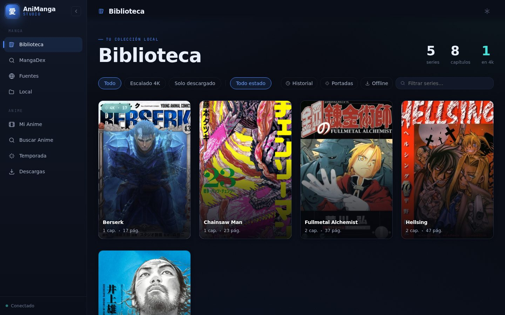
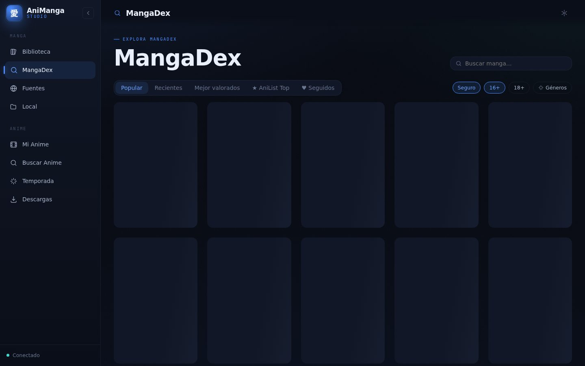
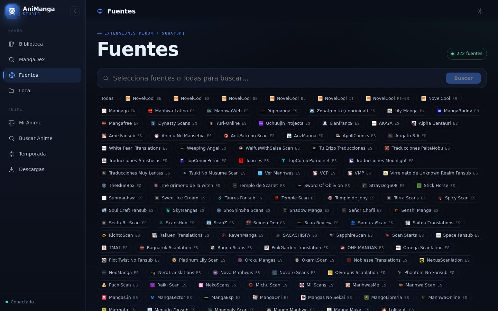
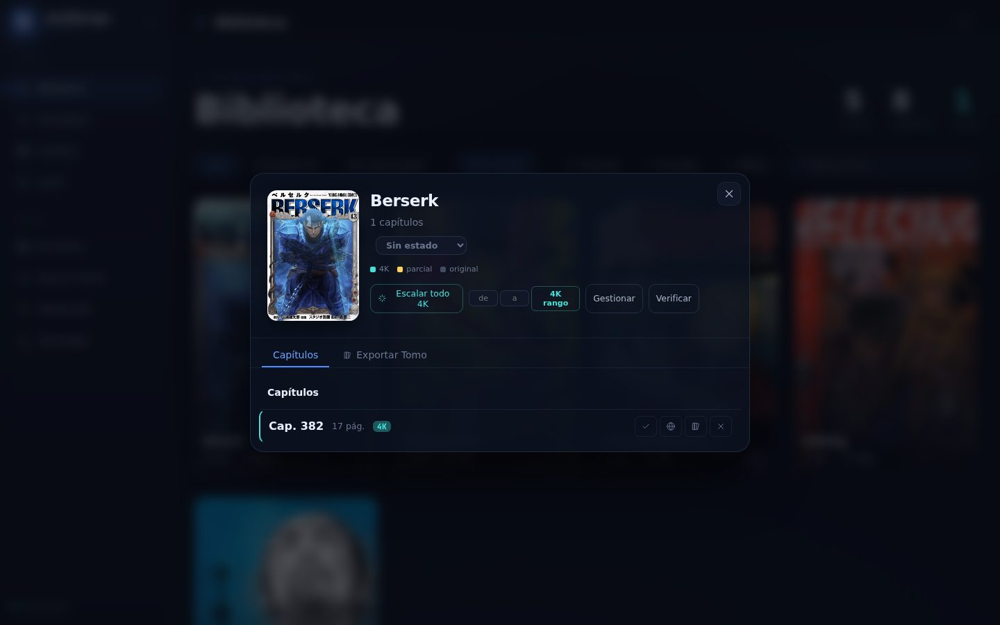
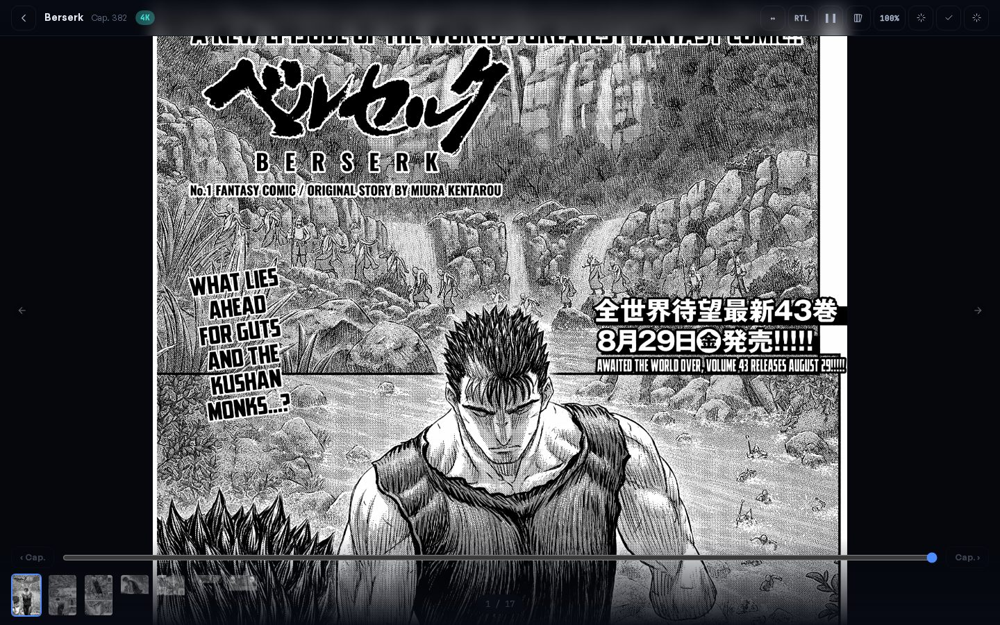
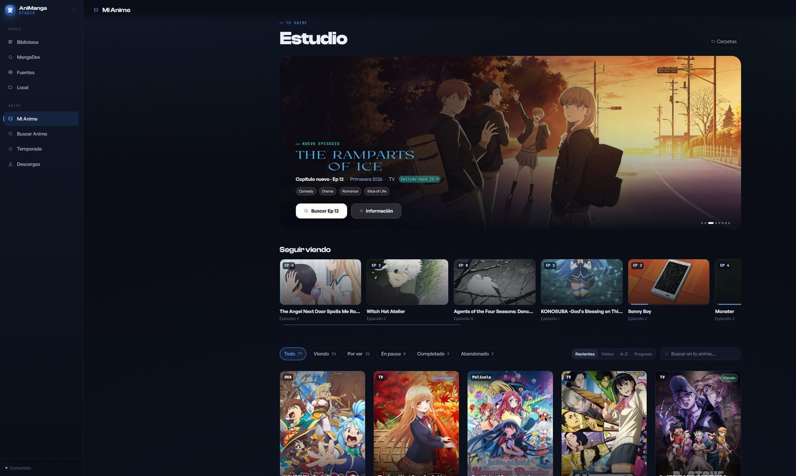
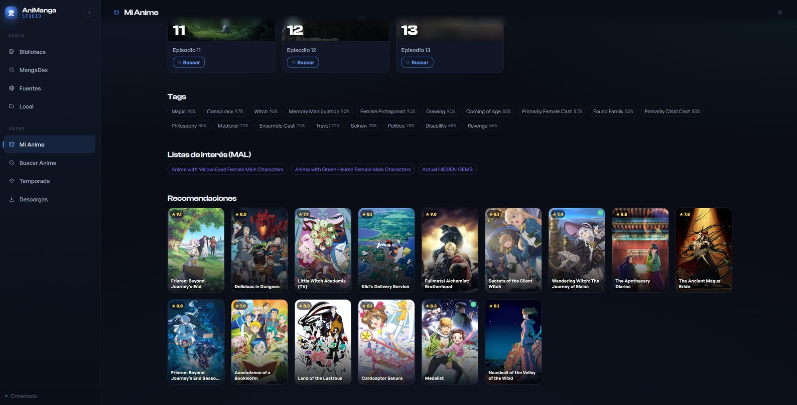
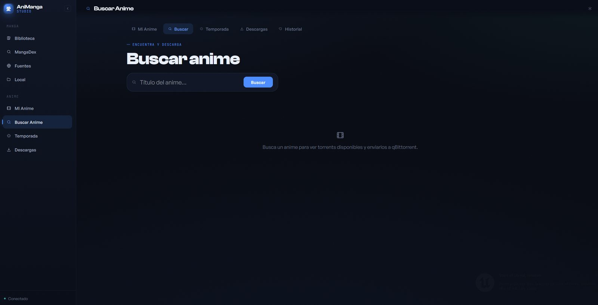
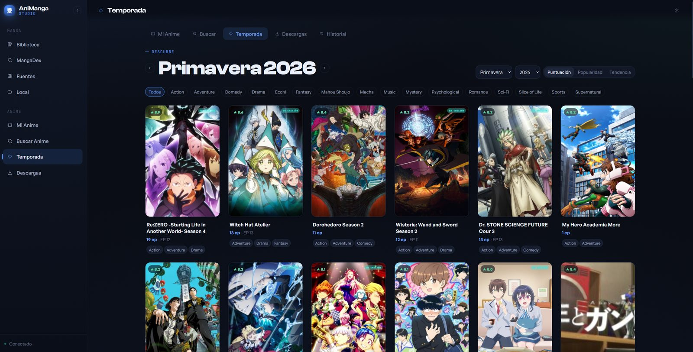
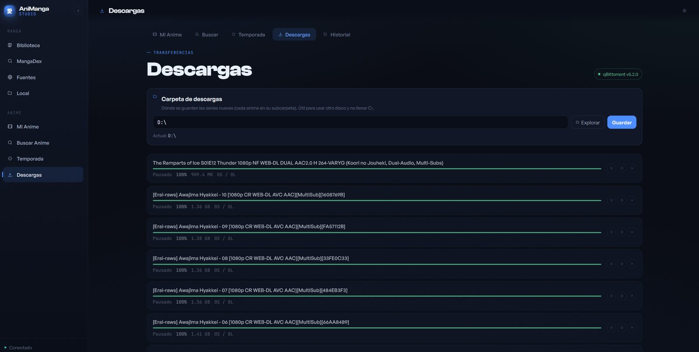

# AniManga Studio

Self-hosted manga manager, AI upscaler and anime studio. Search, download and
read manga from MangaDex or hundreds of other sources (via Suwayomi), upscale
pages with any GPU model you plug in, export to CBZ, and watch tracked anime
with auto-downloaded torrents and synced/translated subtitles — all local,
all yours.

Flask backend · Vue 3 (Vite) frontend · PyTorch GPU upscaler · Suwayomi multi-source.

## Tour

A walkthrough of every view in the app. Manga side first, then Anime Studio.

### Biblioteca (Library)

Your local manga collection — covers, read/unread status, and quick filters
by status. This is the home view.



### MangaDex

Search MangaDex directly (OAuth login optional, needed only to follow titles
or access some scanlation groups), preview chapters, and download them
straight into your local library.



### Fuentes (Sources)

Multi-source search powered by [Suwayomi](https://github.com/Suwayomi/Suwayomi-Server) —
any Mihon/Tachiyomi-compatible extension works here, for titles MangaDex
doesn't have. Downloads land in the same local library as everything else.



### Manga detail & upscale

Opening a manga shows its chapters, read state, and per-chapter actions:
read, compare scanlation variants, export, delete, or **escalar a 4K**
(upscale). The badge shows which chapters are already upscaled.



Upscaling runs on your own GPU with whatever model you register — "bring
your own model," see [docs/MODELS.md](docs/MODELS.md). Progress shows live
in the floating task widget while it processes.

### Lector (Reader)

Built-in reader for downloaded chapters, original or upscaled. Keyboard and
click navigation, page count, and original/4K toggle per chapter.



### Mi Anime (Anime library)

Your tracked anime: a hero banner for the latest episode airing, "seguir
viendo" (continue watching) with progress, and the full library with
status filters and sorting.



### Detalle de anime & recomendaciones

Episode list, tags, MAL-derived "listas de interés," and AniList-powered
recommendations with cover art — click through to add related shows
straight to your library.



### Buscar Anime (Search)

Search AniList for any show and add it to your library, or jump straight
into a torrent search for an episode.



### Temporada (Seasonal)

Current-season chart from AniList with genre/format/sort filters — discover
what's airing without leaving the app.



### Descargas (Downloads)

Nyaa torrent search wired into qBittorrent's WebAPI: pick a release, send it
to qBittorrent, and it lands in your configured download folder, ready to
watch in MPV with skip-intro and synced subtitles.



## Features

- **Manga library**: download, organize and read chapters from MangaDex (OAuth)
  and any Suwayomi/Tachiyomi-compatible source.
- **AI upscaling, "bring your own model"**: drop any [spandrel](https://github.com/chaiNNer-org/spandrel)-compatible
  `.pth`/`.safetensors` weight file into `models/`, register it in
  `models/registry.json`, and it shows up in the UI — any architecture
  (ESRGAN, RRDBNet, SwinIR, HAT, DAT...), any scale, no code changes. See
  [docs/MODELS.md](docs/MODELS.md).
- **CBZ/CBR export** with a Tomo Builder (combine chapters into volumes).
- **Anime Studio**: AniList tracking, Nyaa search, qBittorrent auto-download,
  MPV playback with skip-intro, subtitle search/sync/translation
  (Ollama-local or Gemini) and injection.
- **Mobile export** via WebDAV.

## Quick start

```bash
git clone <this-repo>
cd manga-upscaler
python3 -m venv .venv && source .venv/bin/activate
pip install torch torchvision --index-url https://download.pytorch.org/whl/cu130
pip install -r requirements.txt
cp .env.example .env   # fill in what you need — everything is optional
./start_server.sh
```

Open **http://localhost:5101**.

This is the short version — see **[docs/INSTALL.md](docs/INSTALL.md)** for the
full step-by-step (system packages per OS, Suwayomi, frontend build, secrets,
Windows-without-WSL).

## Requirements

| Component | Notes |
|---|---|
| Python 3.10+ | backend |
| GPU NVIDIA + CUDA | **required** for upscaling — no CPU/AMD/Apple Silicon fallback |
| Node + pnpm | builds the frontend (optional — falls back to a bundled legacy UI) |
| Java 21+ | only if you want Suwayomi (multi-source search) |
| ffmpeg, mkvmerge, mpv, qBittorrent | only for Anime Studio features |

Runs on Linux, macOS, and Windows (natively or via WSL2).

## Project structure

```
manga-upscaler/
├── src/                  # Flask backend (blueprints in src/api/)
├── frontend/             # Vite + Vue 3 SPA (active UI) → frontend/dist/
├── static/ + templates/  # legacy UI, served as fallback at /legacy
├── models/               # your model weights (gitignored) + registry.json
├── data/                 # downloaded/upscaled manga (gitignored, default location)
├── suwayomi/             # Suwayomi-Server runtime (multi-source, optional)
├── docs/                 # INSTALL.md, MODELS.md, and dev/ (internal history)
├── requirements.txt
├── start_server.sh       # Linux/WSL/macOS entry point
└── start_server.ps1      # native Windows entry point
```

## Configuration

Everything lives in `.env` (copy from `.env.example`) — MangaDex OAuth, TMDB,
Gemini, subtitle sources, model/data directories, qBittorrent auto-launch
override. Full reference in [docs/INSTALL.md](docs/INSTALL.md).

## License

MIT — see [LICENSE](LICENSE).
