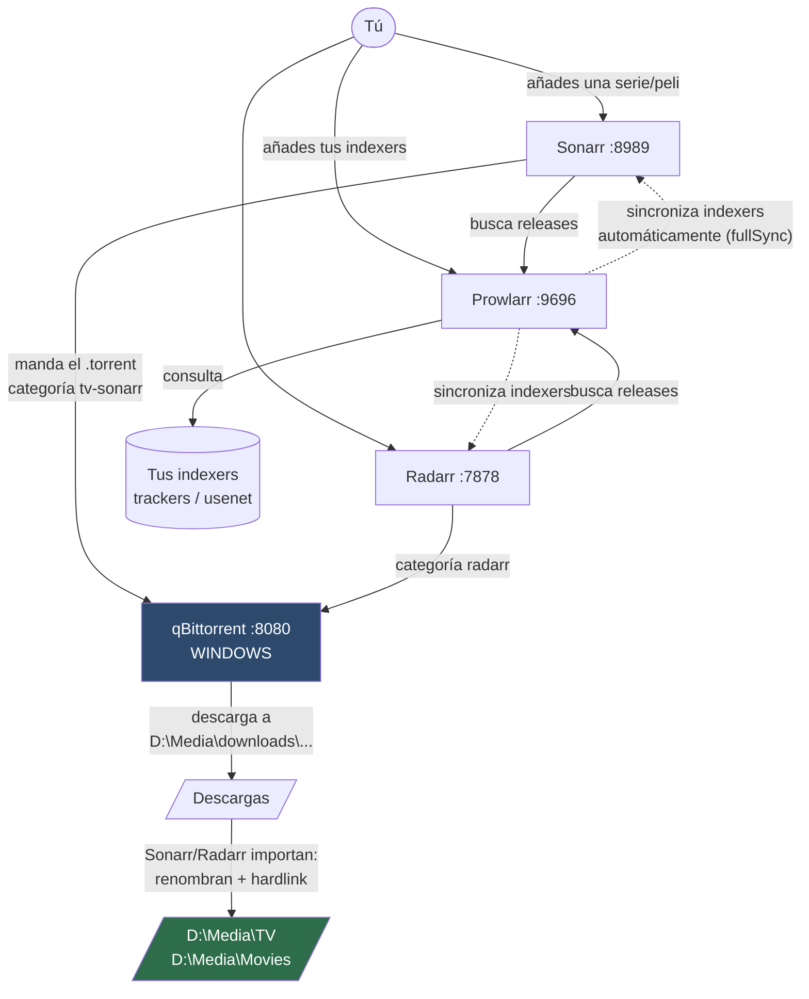

# Stack de series y películas occidentales (Prowlarr · Sonarr · Radarr · qBittorrent)

Fase independiente: **todavía no está integrado con la app**. Se instala, se configura y se usa
por su cuenta, con sus propias interfaces web. La integración se diseñará cuando esto esté
validado en uso real.

## Acceso rápido

| Servicio | URL | Qué hace | Dónde corre |
|---|---|---|---|
| **Prowlarr** | http://localhost:9696 | Gestiona los indexers y se los reparte a los demás | WSL |
| **Sonarr** | http://localhost:8989 | Series: qué te falta, lo busca y lo organiza | WSL |
| **Radarr** | http://localhost:7878 | Películas: igual que Sonarr | WSL |
| **qBittorrent** | http://localhost:8080 | Descarga de verdad los torrents | **Windows** |

```bash
servarr/fetch.sh        # descargar/actualizar los tres (idempotente)
servarr/start.sh        # arrancar (idempotente: no relanza lo que ya corre)
servarr/stop.sh         # parar
python3 servarr/configure.py   # cablear el stack (idempotente)
python3 servarr/verify.py      # comprobar que TODO se habla de verdad
```

## Arquitectura



### El flujo, paso a paso

1. **Añades los indexers una sola vez, en Prowlarr.** Prowlarr los empuja solo a Sonarr y Radarr
   (modo `fullSync`). Esa es toda su razón de ser: sin él tendrías que dar de alta cada tracker
   tres veces y mantenerlos sincronizados a mano.
2. **Añades una serie en Sonarr** (o una película en Radarr). Le dices qué calidad quieres y él
   calcula qué episodios te faltan.
3. **Sonarr busca** a través de Prowlarr en todos tus indexers, puntúa los resultados según tu
   perfil de calidad y elige el mejor.
4. **Manda el torrent a qBittorrent** con la categoría `tv-sonarr` (o `radarr`), que determina la
   carpeta de destino.
5. **Al terminar la descarga**, Sonarr detecta el torrent completado, **renombra** el archivo a un
   nombre canónico y lo **enlaza** a la biblioteca. El torrent original sigue en su sitio sembrando.

## Decisiones de esta instalación (y por qué)

### qBittorrent se reutiliza, no se duplica

Ya tenías qBittorrent en Windows sembrando tu anime. Montar un segundo cliente solo para
series/películas duplicaría puertos, RAM y — lo importante — **partiría la siembra en dos**.
La separación se hace con **categorías**, que es exactamente para lo que existen.

### Todo en `D:\Media`, biblioteca y descargas en el MISMO disco

```
D:\Media\
├── TV\            <- biblioteca de series, ya renombrada y organizada
├── Movies\        <- biblioteca de películas
└── downloads\
    ├── tv\        <- categoría tv-sonarr
    └── movies\    <- categoría radarr
```

Descargas y biblioteca comparten disco **a propósito**: así importar un episodio es un *hardlink*
instantáneo y no una copia. Si estuvieran en discos distintos, cada episodio de 3 GB se copiaría
entero — y tendrías el archivo duplicado en disco mientras siembras.

### El mapeo de rutas Windows↔WSL

Es la pieza frágil de esta arquitectura y la causa nº 1 de "descarga bien pero no importa".
qBittorrent corre en **Windows** y dice que el archivo está en `D:\Media\downloads\tv\...`.
Sonarr corre en **WSL** y ahí esa ruta no existe: para él es `/mnt/d/Media/downloads/tv/...`.

El *remote path mapping* `D:\ → /mnt/d/` traduce entre ambos. Está configurado en Sonarr y Radarr.
Se mapea la **raíz del disco entero**, no solo la carpeta de descargas, para que siga valiendo si
mañana añades otra categoría en `D:`.

> Funciona además porque tu WSL está en `networkingMode=mirrored`, lo que hace que `localhost`
> signifique lo mismo a los dos lados. Sin eso habría que apuntar a la IP del host Windows.

### La configuración vive en el repo

Cada servicio guarda su base de datos SQLite y su API key en `servarr/config/<App>/`, no en
`~/.config`. Así todo el estado del stack se respalda o se borra de una pieza. Está en
`.gitignore` — las API keys son secretos y **no se escriben en ningún script**: `configure.py` y
`verify.py` las leen del `config.xml` en tiempo de ejecución.

## Recomendaciones para un solo usuario

### Perfiles de calidad — el ajuste que más importa

Por defecto Sonarr acepta casi cualquier cosa y acabas con un 720p cuando querías 1080p, o con un
remux de 60 GB que te llena el disco. Con **96 GB libres en `D:`**, lo sensato:

- **Series**: perfil `HD-1080p`, y en *Quality Definitions* pon un techo de tamaño (~5 GB/hora).
  Descarta `Bluray Remux` y `2160p` — un solo episodio remux se come 40 GB.
- **Películas**: `HD-1080p` con techo de ~15 GB. Si algún día quieres 4K, hazlo con un perfil
  aparte y solo para títulos concretos, no como norma.
- Activa **"Propers y Repacks: prefer and upgrade"**: sustituye automáticamente una release con
  fallos por su corrección.

### Espacio en disco — tu cuello de botella real

96 GB no es mucho para series. Dos cosas que te van a ahorrar disgustos:

- En qBittorrent, pon un **ratio o tiempo de siembra máximos** por categoría, y que al alcanzarlos
  **pare** el torrent (no que lo borre). Luego Sonarr puede limpiarlo.
- Activa en Sonarr/Radarr *Settings → Download Client → **Remove Completed*** para que borre el
  torrent del cliente cuando ya cumplió su siembra. El hardlink en la biblioteca sobrevive.
- Vigila el aviso de salud "No space left" — `verify.py` te lo muestra.

### Organización y nombres

Deja el **renombrado automático activado** con el formato estándar de Sonarr
(`{Series Title} - S{season:00}E{episode:00} - {Episode Title}`). No lo personalices por gusto: el
formato estándar es el que reconocen Plex, Jellyfin, Kodi y cualquier cosa que conectes después.
Es también lo que hará trivial la futura integración con tu app.

### Mantenimiento a largo plazo

- **Actualizar**: `servarr/fetch.sh` con `SERVARR_FORCE=1` baja siempre la última versión. Los tres
  proyectos publican actualizaciones frecuentes; una vez cada pocos meses basta.
- **Respaldo**: copia `servarr/config/`. Ahí está todo — indexers, series, historial. Sonarr y
  Radarr también generan backups solos en *System → Backup*.
- **Salud**: `python3 servarr/verify.py` es el chequeo de un vistazo. Úsalo antes de sospechar de
  nada más.
- **Arranque**: los servicios **no arrancan solos** al iniciar Windows. Si quieres eso, se puede
  añadir a `desktop/` cuando integremos; por ahora es `servarr/start.sh` a mano, deliberadamente.

## Lo que TODAVÍA no está validado

Honestamente: el flujo de descarga de punta a punta **no se ha probado**, porque no se puede
probar sin indexers y esos los pones tú. Lo verificado hasta aquí es toda la infraestructura y
todas las conexiones entre servicios (`verify.py` en verde).

**Tu siguiente paso:**

1. Abre http://localhost:9696 → *Indexers* → *Add Indexer* y añade los tuyos.
2. Vuelve a correr `python3 servarr/verify.py`: los indexers deben aparecer listados, y en
   Sonarr/Radarr (*Settings → Indexers*) deben haber aparecido **solos**. Si aparecen ahí sin que
   los toques, la sincronización de Prowlarr funciona.
3. Añade una serie en Sonarr y pídele un episodio con *Search*. Sigue el rastro:
   Activity → Queue en Sonarr → qBittorrent → y que acabe apareciendo renombrado en `D:\Media\TV`.

Ese tercer paso es la validación real del flujo completo.
